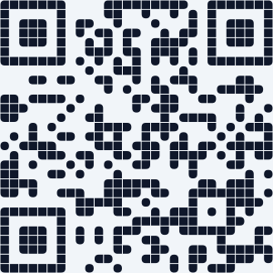
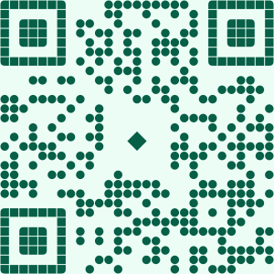
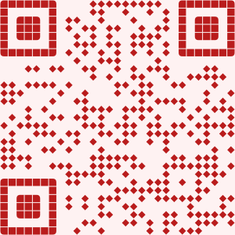

# QR Generator

[](https://github.com/NeaByteLab/QR-Generator) [](https://www.npmjs.org/package/@neabyte/qr-generator) [](https://jsr.io/@neabyte/qr-generator) [](https://github.com/NeaByteLab/QR-Generator/actions/workflows/ci.yaml) [](LICENSE)

Generate QR as SVG, path, GIF, ASCII, or canvas. Seven shapes (rounded, circle, diamond, square, shuriken, star, triangle), finder styling, solid or linear/radial gradients, logo (text/image). Deno (JSR) and npm.

**Prerequisites:** For **Deno** use [Deno](https://deno.com/) (install from [deno.com](https://deno.com/)). For **npm** use Node.js (e.g. [nodejs.org](https://nodejs.org/)).

|                 No logo                  |                  Text logo                   |                 Variant                  |
| :--------------------------------------: | :------------------------------------------: | :--------------------------------------: |
|  |  |  |

> [!IMPORTANT]
> Generate preview assets (SVGs; GIFs if `rsvg-convert` is installed): `deno run -A preview/generator.ts`

## Features

- **Multiple output formats** — SVG string (`toSVG`), raw path data (`toPath`), GIF data URL (`toDataURL`), ASCII art (`toASCII`), table/img HTML (`toTableTag`, `toImgTag`), and canvas rendering (`toCanvas`).
- **Finder pattern styling** — Separate shape and gap for the three corner finder patterns.
- **Custom module shapes** — Rounded, circle, diamond, square, shuriken, star, triangle; configurable gap.
- **Color options** — Solid color or linear/radial gradients with full control over stops and geometry.
- **Center logo** — Text or image overlay with size and corner radius; SVG output escapes attributes.

## Installation

**Deno (JSR):**

```bash
deno add jsr:@neabyte/qr-generator
```

**npm:**

```bash
npm install @neabyte/qr-generator
```

## Quick Start

Pass **value** (text or URL) and **size** (width/height in px). You get an SVG string.

```typescript
import QRCode from '@neabyte/qr-generator'

const svg = QRCode.toSVG({
  value: 'https://neabyte.com/',
  size: 400,
  color: '#000000',
  background: '#ffffff'
})
// Use in HTML, save to file, or return from API
```

- [USAGE.md](USAGE.md) for all options (shapes, gradients, logo, `toPath`, etc.).
- [examples/README.md](examples/README.md) for runnable scripts.

## Build & Test

From the repo root (requires [Deno](https://deno.com/)).

**Check** — format, lint, and typecheck source:

```bash
deno task check
```

**Unit tests** — format/lint tests and run all tests:

```bash
deno task test
```

- Tests live under `tests/` (public API in `tests/qrcode.test.ts`, core helpers in `tests/core/*.test.ts`).
- The test task uses `--allow-read` for fixtures (e.g. PNG decode tests).

## Reference

- [Portable Network Graphics (PNG) Specification](https://www.w3.org/TR/png/) — W3C PNG (Third Edition); used for PNG decode in core
- [SVG path `d` attribute](https://developer.mozilla.org/en-US/docs/Web/SVG/Tutorial/Paths) — MDN tutorial on path syntax (for `toPath()` output)
- [react-native-qrcode-skia](https://github.com/enzomanuelmangano/react-native-qrcode-skia) — React Native QRCode Skia

## Attribution & Trademark

- This library is based on [qrcode-generator](https://github.com/kazuhikoarase/qrcode-generator) by Kazuhiko Arase (MIT).

- The implementation follows **JIS X 0510:1999**. The word **"QR Code"** is a registered trademark of **DENSO WAVE INCORPORATED**. See: [FAQ on QR Code patents/trademarks](http://www.denso-wave.com/qrcode/faqpatent-e.html).

## License

This project is licensed under the MIT license. See the [LICENSE](LICENSE) file for details.
