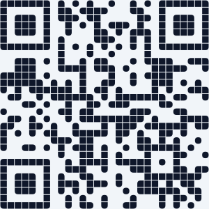
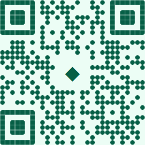
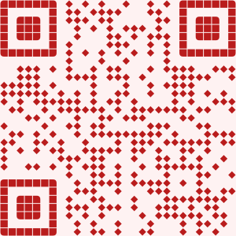
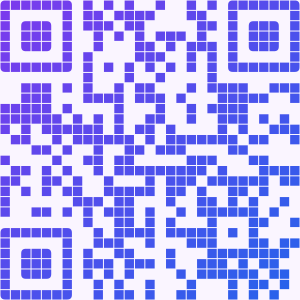
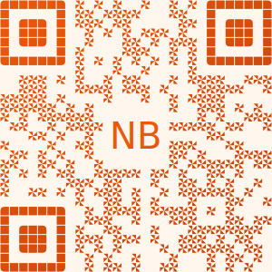
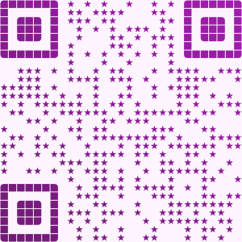
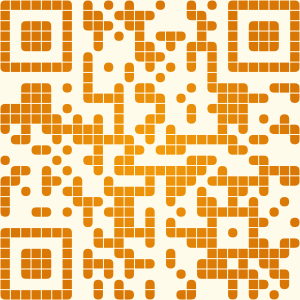
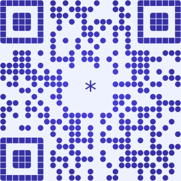
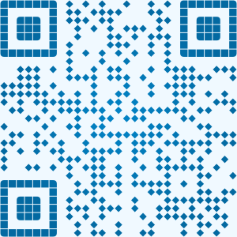

# QR-Generator [](https://github.com/NeaByteLab/QR-Generator) [](https://www.npmjs.org/package/@neabyte/qr-generator) [](https://jsr.io/@neabyte/qr-generator) [](https://github.com/NeaByteLab/QR-Generator/actions/workflows/ci.yaml) [](LICENSE)

Generates QR codes as SVG. Custom module shapes (rounded, circle, diamond, square, shuriken, star), solid or linear/radial gradient colors, optional center logo (text or image). Works with Deno (JSR) and npm.

|            |                        No logo                         |                         Text logo                          |                        Variant                         |
| :--------- | :----------------------------------------------------: | :--------------------------------------------------------: | :----------------------------------------------------: |
| **Solid**  |    |    |          |
| **Linear** |  |  |  |
| **Radial** |  |  |          |

_Generate preview SVGs: `deno run --allow-write preview/generator.ts`_

## Installation

**Deno (JSR):**

```bash
deno add jsr:@neabyte/qr-generator
```

**npm:**

```bash
npm install @neabyte/qr-generator
```

## Usage

### Quick start

```typescript
import QRCode from '@neabyte/qr-generator'

const svg = QRCode.toSVG({
  value: 'https://neabyte.com/',
  size: 400,
  color: '#000000',
  background: '#ffffff'
})
// Use svg string in DOM, file, or response
```

### Options overview

**SVGOptions** extends QR code options with `color` and `background`:

- **value** `<string>` – Content to encode (required).
- **size** `<number>` – Output SVG width/height in pixels (required).
- **error** – Error correction: `{ level?: 'L' | 'M' | 'Q' | 'H' }`. Default `'H'`.
- **finder** – Finder pattern: `{ shape?: ModuleShape; gap?: number }`. Default `{ shape: 'rounded', gap: 0 }`.
- **module** – Data modules: `{ shape?: ModuleShape; gap?: number }`. Default `{ shape: 'rounded', gap: 0 }`.
- **logo** – Center overlay: `{ size?: number; radius?: number; text?: string; image?: string }`.
- **color** – Fill: solid CSS color string or gradient (see below). Default `QRCode.defaultColor` (`'#000000'`).
- **background** – Background color. Default `QRCode.defaultBackground` (`'#ffffff'`).

**Class properties:** `QRCode.defaultColor` and `QRCode.defaultBackground` are the fallback fill and background when options omit `color` or `background`. You can read them for consistency or override by passing options.

### Path API

Use **toSVG** when you need a full SVG string. Use **toPath** when you need the raw path for custom rendering (e.g. canvas or custom SVG). It accepts **QRCodeOptions** (same as SVGOptions but without `color` or `background`) and returns **PathResult** `{ cellSize: number; path: string }`.

```typescript
const { cellSize, path } = QRCode.toPath({
  value: 'https://neabyte.com/',
  size: 400,
  module: { shape: 'circle' },
  logo: { size: 80, text: 'QR' }
})
// Use path (SVG path d) and cellSize for your own fill/viewBox
```

### Module shapes

Both finder and data modules support these **ModuleShape** values:

- `'circle'` – circles
- `'diamond'` – diamonds
- `'rounded'` – rounded squares (default)
- `'square'` – squares
- `'shuriken'` – four-blade shape
- `'star'` – five-point star
- `'triangle'` – triangles

Example with different finder and module shapes:

```typescript
const svg = QRCode.toSVG({
  value: 'https://neabyte.com/',
  size: 500,
  finder: { shape: 'rounded', gap: 2 },
  module: { shape: 'circle', gap: 1 },
  color: '#1e3a5f',
  background: '#f8fafc'
})
```

### Color: solid and gradients

**Solid:** pass a CSS color string.

```typescript
color: '#0c4a6e'
```

**Linear gradient:** `type: 'linear'` with optional `x1`, `y1`, `x2`, `y2` (0–1, relative to the path bounding box) and `stops`.

```typescript
color: {
  type: 'linear',
  x1: 0, y1: 0, x2: 1, y2: 1,
  stops: [
    { offset: 0, color: '#0c4a6e' },
    { offset: 1, color: '#0ea5e9' }
  ]
}
```

**Radial gradient:** `type: 'radial'` with optional `cx`, `cy`, `r`, `fx`, `fy` (0–1, relative to bounding box) and `stops`.

```typescript
color: {
  type: 'radial',
  cx: 0.5, cy: 0.5, r: 0.5,
  stops: [
    { offset: 0, color: '#0ea5e9' },
    { offset: 1, color: '#0c4a6e' }
  ]
}
```

### Logo overlay

Center logo can be text or an image. Logo area is cut out of the QR path; the logo is drawn on top.

**Text logo:**

```typescript
logo: {
  size: 120,
  radius: 8,
  text: '*'
}
```

**Image logo:** base64 data URI only. URL is not supported.

```typescript
logo: { size: 100, radius: 4, image: 'data:image/png;base64,iVBORw0KGgo...' }
```

- **size** – Logo area in pixels. Default 80 when `text` or `image` is set.
- **radius** – Corner radius of the logo cutout. Default 0.

### Full example

```typescript
import QRCode, { type SVGOptions } from '@neabyte/qr-generator'

const options: SVGOptions = {
  value: 'https://neabyte.com/',
  size: 600,
  error: { level: 'H' },
  finder: { shape: 'rounded', gap: 2 },
  module: { shape: 'rounded', gap: 2 },
  logo: { size: 200, text: '*', radius: 8 },
  color: {
    type: 'linear',
    stops: [
      { offset: 0, color: '#0c4a6e' },
      { offset: 1, color: '#0ea5e9' }
    ]
  },
  background: '#ffffff'
}

const svg = QRCode.toSVG(options)
await Deno.writeTextFile('qrcode.svg', svg)
```

**Exported types:** `SVGOptions`, `QRCodeOptions`, `PathResult`, `ErrorLevel`, `ModuleShape`, `LinearGradient`, `RadialGradient`, `GradientStop`, `LogoOptions`, and the rest of the type set from the module. Use `import QRCode, { type SVGOptions, type PathResult } from '@neabyte/qr-generator'` (or equivalent) as needed.

## Reference

- [SVG path `d` attribute](https://developer.mozilla.org/en-US/docs/Web/SVG/Tutorial/Paths) — MDN tutorial on path syntax (for `toPath()` output)
- [react-native-qrcode-skia](https://github.com/enzomanuelmangano/react-native-qrcode-skia) — React Native QRCode Skia

## License

This project is licensed under the MIT license. See the [LICENSE](LICENSE) file for details.
