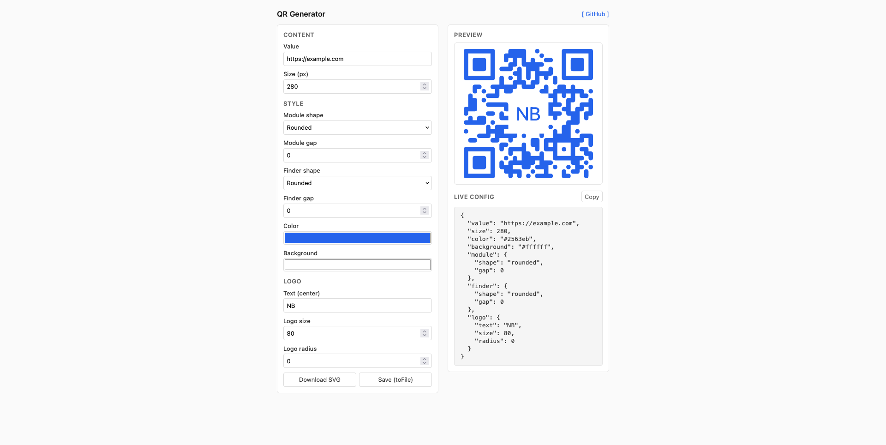
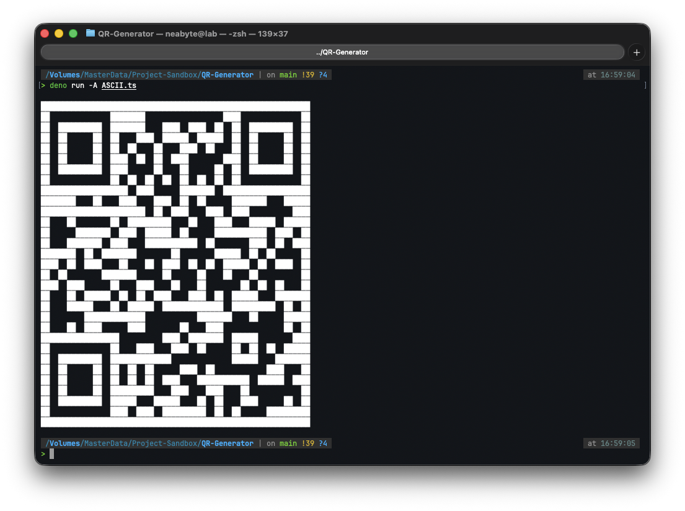

# Usage

Options, shapes, gradients, logo, and output formats for `@neabyte/qr-generator`.



> [!NOTE]
> Try the [live demo](https://neabytelab.github.io/QR-Generator) to tweak options and copy config.

## Quick Start

Import the default export and call a static method. Only `value` is required for most methods; `toSVG` and `toPath` also require `size`. See [examples/](examples/README.md) for runnable samples.

```typescript
import QRCode from '@neabyte/qr-generator'

const svg = QRCode.toSVG({
  value: 'https://example.com',
  size: 400,
  color: '#000000',
  background: '#ffffff'
})
```

## Methods Overview

| Method                | Options              | Returns           | Description                                             |
| :-------------------- | :------------------- | :---------------- | :------------------------------------------------------ |
| `QRCode.toASCII`      | FormatOptions        | string            | Terminal-style block or half-block art.                 |
| `QRCode.toCanvas`     | (ctx, FormatOptions) | void              | Draws QR on given 2D context.                           |
| `QRCode.toDataURL`    | FormatOptions        | string            | `data:image/gif;base64,...`.                            |
| `QRCode.toFile`       | (path, SVGOptions)   | Promise\<void\>   | Writes SVG to file (or triggers download in browser).   |
| `QRCode.toFileStream` | (stream, SVGOptions) | Promise\<void\>   | Writes SVG to writable stream.                          |
| `QRCode.toPath`       | QRCodeOptions        | PathResult        | `{ cellSize, path }` for custom rendering.              |
| `QRCode.toPNG`        | PNGOptions           | Promise\<string\> | `data:image/png;base64,...`; optional color/background. |
| `QRCode.toSVG`        | SVGOptions           | string            | Full SVG with path, fill, defs, optional logo.          |
| `QRCode.toTableTag`   | FormatOptions        | string            | HTML `<table>...</table>`.                              |

### Pick a Method by What You Need

| I want to…                      | Use this              | Minimal call                                                            |
| :------------------------------ | :-------------------- | :---------------------------------------------------------------------- |
| Draw on my own canvas           | `QRCode.toCanvas`     | `toCanvas(ctx, { value: '…' })`                                         |
| Get an SVG to show or save      | `QRCode.toSVG`        | `toSVG({ value: '…', size: 400 })`                                      |
| Get GIF for `` or download | `QRCode.toDataURL`    | `toDataURL({ value: '…' })`                                             |
| Get HTML table                  | `QRCode.toTableTag`   | `toTableTag({ value: '…' })`                                            |
| Get path string for custom draw | `QRCode.toPath`       | `toPath({ value: '…', size: 400 })`                                     |
| Get PNG for `` or download | `QRCode.toPNG`        | `await QRCode.toPNG({ value: '…', color: '#000', background: '#fff' })` |
| Print QR in terminal            | `QRCode.toASCII`      | `toASCII({ value: '…' })`                                               |
| Write SVG to file or download   | `QRCode.toFile`       | `toFile('out.svg', { value: '…', size: 400 })`                          |
| Write SVG to a stream           | `QRCode.toFileStream` | `toFileStream(stream, { value: '…', size: 400 })`                       |

> [!NOTE]
> Every method needs at least `value` (the text or URL to encode). `toSVG`, `toPath`, `toFile`, and `toFileStream` also need `size` (width/height in pixels). `toASCII`, `toDataURL`, `toPNG`, and `toTableTag` use optional `cellSize` and `margin` for dimensions.

## Options

### toSVG (Full Options)

`toSVG` accepts **SVGOptions**: required `value` and `size`; optional `color`, `background`, `error`, `finder`, `module`, `logo`. Error level defaults to `'H'`. Module and finder default to `shape: 'rounded'`, `gap: 0`.

```typescript
const svg = QRCode.toSVG({
  value: 'https://example.com',
  size: 400,
  color: '#1a1a1a',
  background: '#f5f5f5',
  error: { level: 'M' },
  finder: { shape: 'circle', gap: 2 },
  module: { shape: 'rounded', gap: 1 },
  logo: { size: 80, radius: 8, text: 'Hi' }
})
```

### Color (Solid and Gradients)

- **Solid:** pass a string (e.g. `'#000000'`, `'rgb(0,0,0)'`). Omitted or invalid color falls back to `QRCode.defaultColor` (`#000000`).
- **Linear gradient:** `type: 'linear'`, optional `x1`, `y1`, `x2`, `y2` (0–1, object bounding box), and `stops: [{ offset, color }]`. Defaults: x1=0, y1=0, x2=1, y2=1.
- **Radial gradient:** `type: 'radial'`, optional `cx`, `cy`, `r`, `fx`, `fy`, and `stops`. Defaults: cx=cy=0.5, r=0.5; `fx`/`fy` only added when both provided.

```typescript
QRCode.toSVG({
  value: 'https://example.com',
  size: 400,
  color: {
    type: 'linear',
    x1: 0,
    y1: 0,
    x2: 1,
    y2: 1,
    stops: [
      { offset: 0, color: '#000' },
      { offset: 1, color: '#333' }
    ]
  }
})

QRCode.toSVG({
  value: 'https://example.com',
  size: 400,
  color: {
    type: 'radial',
    cx: 0.5,
    cy: 0.5,
    r: 0.5,
    stops: [
      { offset: 0, color: '#111' },
      { offset: 1, color: '#000' }
    ]
  }
})
```

### Module and Finder Shapes

**ModuleShape:** `'circle' | 'diamond' | 'rounded' | 'square' | 'shuriken' | 'star' | 'triangle'`.

- **finder** — the three corner finder patterns (7×7 each); `shape` and `gap` apply only there.
- **module** — all other (data) modules; `shape` and `gap` apply there.

```typescript
QRCode.toSVG({
  value: 'https://example.com',
  size: 400,
  finder: { shape: 'square', gap: 0 },
  module: { shape: 'circle', gap: 1 }
})
```

### Logo (Text or Image)

- **Text logo:** `logo: { size?: number, radius?: number, text: string }`. Text is centered; font size is ~50% of logo size. Defaults: size 80, radius 0. Empty string `text` is treated as no text logo.
- **Image logo:** `logo: { size?: number, radius?: number, image: string }`. `image` is a data URI or URL (e.g. `data:image/png;base64,...`). Default size 80. The QR path is cut out in the center so the logo sits in the quiet area; `radius` rounds that cutout.

You can set both `text` and `image`; both are rendered (text then image in SVG order).

```typescript
QRCode.toSVG({
  value: 'https://example.com',
  size: 400,
  logo: { size: 72, radius: 6, text: 'QR' }
})

QRCode.toSVG({
  value: 'https://example.com',
  size: 400,
  logo: { size: 80, image: 'data:image/png;base64,...' }
})
```

### toPath (Path Only)

Use `toPath` when you need the path string and cell size (e.g. for canvas, Skia, or custom SVG). Options are **QRCodeOptions**: required `value` and `size`; optional `error`, `finder`, `module`, `logo`. No `color` or `background`; you apply fill yourself. `cellSize` in the result is `size / matrixSideLength`.

```typescript
const { cellSize, path } = QRCode.toPath({
  value: 'https://example.com',
  size: 400,
  finder: { shape: 'rounded' },
  module: { shape: 'rounded' }
})
// path: SVG path d attribute; use with <path d={path} fill="..." />
```

### toFile

Writes SVG to file via platform storage. Uses **SVGOptions** (same as `toSVG`). On Deno/Node writes to the given path; in the browser triggers a download with the path as filename.

```typescript
await QRCode.toFile('./output.svg', {
  value: 'https://example.com',
  size: 400,
  color: '#000000',
  background: '#ffffff'
})
```

### toFileStream

Writes SVG to a writable stream (e.g. Node `Writable` or adapter with `write` and optional `end`). Uses **SVGOptions**. Calls `stream.write(svg)` then `stream.end()` if present. Useful for server responses or piping.

```typescript
const stream = createWriteStream('./output.svg')
await QRCode.toFileStream(stream, {
  value: 'https://example.com',
  size: 400
})
```

### toASCII, toDataURL, toTableTag

<p align="center"></p>

These use **FormatOptions**: required `value`; optional `error`, `cellSize`, `margin`. When omitted: `toDataURL` and `toTableTag` use cellSize 2, margin cellSize×4; `toASCII` uses Format defaults (cellSize 1 → half-block style, margin 2). `toCanvas` ignores `margin`.

```typescript
const ascii = QRCode.toASCII({ value: 'hello-world', cellSize: 2, margin: 8 })
const dataUrl = QRCode.toDataURL({ value: 'hello-world', cellSize: 2, margin: 8 })
const tableHtml = QRCode.toTableTag({ value: 'hello-world', cellSize: 2, margin: 8 })
```

### toPNG

Returns a PNG data URL with optional hex foreground and background. Uses **PNGOptions**: required `value`; optional `error`, `cellSize`, `margin`, `color`, `background`. When both `color` and `background` are set the output is RGB; otherwise grayscale. Defaults: cellSize 2, margin cellSize×4.

```typescript
const pngUrl = await QRCode.toPNG({
  value: 'hello-world',
  cellSize: 10,
  margin: 25,
  color: '#0f172a',
  background: '#f1f5f9'
})
// pngUrl: data:image/png;base64,...
```

### toCanvas

Draws the QR on a 2D canvas context. Uses **FormatOptions** (`value`, optional `error`, `cellSize`); `margin` is not used. Default cellSize is 2.

```typescript
const canvas = document.createElement('canvas')
const ctx = canvas.getContext('2d')
if (ctx) {
  QRCode.toCanvas(ctx, { value: 'https://example.com/', cellSize: 4 })
}
```

## API Reference

### QRCode.toASCII(options)

Use when you want to print a QR in the terminal or get a text-only preview.

- `options` `<FormatOptions>`: `value` (required), `error?`, `cellSize?`, `margin?`.
- Returns: `<string>` Multiline ASCII (block or half-block by cellSize).
- Encodes value and renders grid as text.

### QRCode.toCanvas(ctx, options)

Use when you already have a `<canvas>` and its 2D context and want to draw the QR there (e.g. in a browser or Node with `canvas`).

- `ctx` `<CanvasRenderingContext2D>`: 2D context to draw into (from `canvas.getContext('2d')`).
- `options` `<FormatOptions>`: `value` (required), `error?`, `cellSize?` (margin ignored). Default cellSize 2.
- Returns: `<void>`.
- Encodes value and fills rects per module (black/white).

### QRCode.toDataURL(options)

Use when you need a data URL for `` or for download (e.g. "Save as image"). Output is GIF.

- `options` `<FormatOptions>`: `value` (required), `error?`, `cellSize?`, `margin?`.
- Returns: `<string>` `data:image/gif;base64,...`.
- Encodes value and renders grid as GIF data URL. Defaults: cellSize 2, margin cellSize×4.

### QRCode.toFile(path, options)

Use when you want to write the SVG to a file. On Deno/Node writes to the given path; in the browser triggers a download with the path as the filename.

- `path` `<string>`: File path (Deno/Node) or download filename (browser).
- `options` `<SVGOptions>`: `value` (required), `size` (required), `color?`, `background?`, `error?`, `finder?`, `module?`, `logo?`.
- Returns: `<Promise<void>>`.
- Uses platform storage from `getDefaultStorage()`; no filesystem in browser, only download.

### QRCode.toFileStream(stream, options)

Use when you want to write the SVG to a writable stream (e.g. Node `Writable`, or an adapter with `write` and optional `end`). Calls `stream.write(svg)` then `stream.end()` if present.

- `stream` `<WritableStreamLike>`: Object with `write(data: string | Uint8Array)` and optional `end()`; may return `Promise<void>`.
- `options` `<SVGOptions>`: Same as `toSVG`.
- Returns: `<Promise<void>>`.

### QRCode.toPath(options)

Use when you need the raw path and cell size (e.g. custom SVG, canvas, or Skia).

- `options` `<QRCodeOptions>`: `value` (required), `size` (required), `error?`, `finder?`, `module?`, `logo?`.
- Returns: `<PathResult>` `{ cellSize: number, path: string }`.
- Encodes value, builds matrix, applies shape options and logo cutout, returns path `d` and cell size.

### QRCode.toPNG(options)

Use when you need a PNG data URL for `` or for download, with optional foreground/background hex colors.

- `options` `<PNGOptions>`: `value` (required), `error?`, `cellSize?`, `margin?`, `color?`, `background?`. Same as FormatOptions plus optional hex `color` and `background`; when both are set the PNG is RGB, otherwise grayscale.
- Returns: `<Promise<string>>` `data:image/png;base64,...`.
- Defaults: cellSize 2, margin cellSize×4.

### QRCode.toSVG(options)

Use when you need a full SVG string (e.g. inject in HTML, save as `.svg`, or send from API).

- `options` `<SVGOptions>`: `value` (required), `size` (required), `color?`, `background?`, `error?`, `finder?`, `module?`, `logo?`.
- Returns: `<string>` SVG document.
- Builds path via toPath, resolves color (solid or gradient defs), adds background rect, path, and optional text/image logo. Background defaults to `QRCode.defaultBackground` (`#ffffff`) when omitted.

### QRCode.toTableTag(options)

Use when you need an HTML `<table>` snippet (e.g. email or legacy layout).

- `options` `<FormatOptions>`: `value` (required), `error?`, `cellSize?`, `margin?`.
- Returns: `<string>` HTML table element. Defaults: cellSize 2, margin cellSize×4.

## Option Types

Types are exported for TypeScript: `import type { ColorOption, FormatOptions, PathResult, PNGOptions, QRCodeOptions, SVGOptions, WritableStreamLike } from '@neabyte/qr-generator'`.

- **ColorOption:** `<string>` | **LinearGradient** | **RadialGradient**. **GradientStop:** `offset` (0–1), `color` `<string>`.
- **ErrorOptions:** `level?` `<ErrorLevel>`. **ErrorLevel:** `'L' | 'M' | 'Q' | 'H'`.
- **FinderOptions / ModuleOptions:** `shape?` `<ModuleShape>`, `gap?` `<number>`.
- **FormatOptions:** `value` `<string>`, `error?` `<ErrorOptions>`, `cellSize?` `<number>`, `margin?` `<number>`.
- **LogoOptions:** `size?` `<number>`, `radius?` `<number>`, `text?` `<string>`, `image?` `<string>`.
- **ModuleShape:** `'circle' | 'diamond' | 'rounded' | 'square' | 'shuriken' | 'star' | 'triangle'`.
- **PathResult:** `cellSize` `<number>`, `path` `<string>`.
- **PNGOptions:** FormatOptions & `color?` `<string>`, `background?` `<string>` (hex e.g. `#000`, `#fff`). Used by `toPNG`.
- **QRCodeOptions:** `value` `<string>`, `size` `<number>`, `error?`, `finder?` `<FinderOptions>`, `module?` `<ModuleOptions>`, `logo?` `<LogoOptions>`.
- **SVGOptions:** QRCodeOptions & `color?` `<ColorOption>`, `background?` `<string>`.
- **WritableStreamLike:** `write(data: string | Uint8Array): void | Promise<void>`, `end?(): void | Promise<void>` (for `toFileStream`).

## Reference

- [README](README.md) — Installation and quick start.
- [examples/](examples/README.md) — Runnable samples for each method and options.
- [SVG path `d` attribute](https://developer.mozilla.org/en-US/docs/Web/SVG/Tutorial/Paths) — For `toPath()` output.
